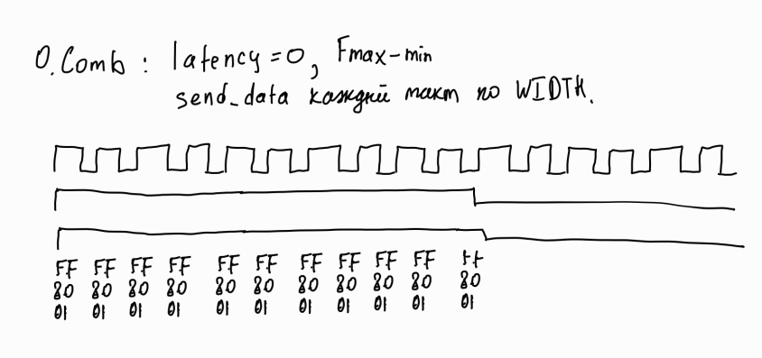
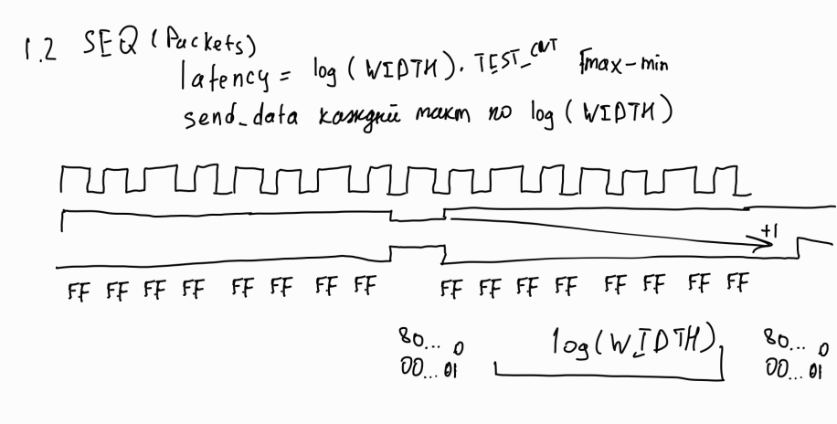
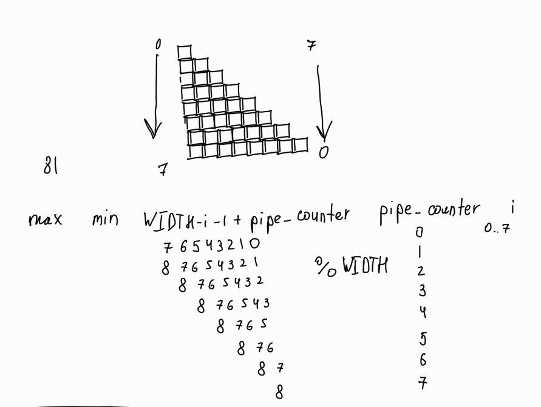

# priority_encoder

## task
Модуль должен во входном N-битном числе найти самую правую и самую левую единицу и оставить только ее.
На входе → Крайняя левая единица; Крайняя правая единица

## desc

| Параметр | Комментарий        | 
| -------- | ------------------ |
| WIDTH    | Разрядность данных |

| Имя сигнала  | Напр-е | Разрядность | Комментарий                                         |
| ------------ | ------ | ----------- |:--------------------------------------------------- |
| clk_i        | input  | 1           | Тактовый сигнал.                                    |
| srst_i       | input  | 1           | Синхронный сброс.                                   |
| data_i       | input  | WIDTH       | Входные данные.                                     |
| data_val_i   | input  | 1           | Сигнал валидности входных данных.                   |
| data_left_o  | output | WIDTH       | Выходная крайняя левая единица.                     |
| data_right_o | output | WIDTH       | Выходная крайняя правая единица.                    |
| data_val_o   | output | 1           | Подтверждает валидность data_right_o и data_left_o. |

Есть несколько реализаций, причем тест работает только для COMB и PIPE версий
- COMB_BASIC              // (+) 1 clock cycle latency, O(n)
- COMB_KR                 // (+) 1 clock cycle latency, O(n), but faster & lighter
- COMB_LOG                // (+) 1 clock cycle latency, O(log n) - heavyweight & slow
- SEQ_LINEAR              // (+) WIDTH clock cycle latency, O(n), sequential, output: 1 bit at a time
- PIPE_LINEAR             // (?) WIDTH clock cycle latency, O(n), sequential & pipelined, 1 bit at a time, output: WIDTH bit at a time

Чтобы выбрать нужно убрать комментарий у define, при этом можно оставить только 1 опцию.

### alg
#### COMB_BASIC
- 4 комбинационных блока, для :
    - присваивания во временную переменную data_i_copy значение data_i
    - вычисления data_left_o и data_right_o (с помощью вычисления max и min, соответственно)
    - выставление output валидности (в тот же такт, что и input)
- Остановка итераторов происходит, если бит data_i_copy положительный, начиная с противоположных концов (min и max).
- Передача во внешнюю среду происходит за 1 такт, после этого будут набираться новые значения

#### COMB_KR
K&R - Kernighan & Ritchie
- 4 комбинационных блока, для :
    - присваивания во временную переменную data_i_copy значение data_i. В последущем вычисления минимума, за 1 битовую операцию (2-адичные числа)
    - присваивания во временную переменную data_i_copy_reverse значение перевернутого data_i. В последущем вычисления максимума, за 1 битовую операцию
    - выставление output валидности (в тот же такт, что и input)
- Передача во внешнюю среду происходит за 1 такт, после этого будут набираться новые значения

#### COMB_LOG
- 3 комбинационных блока, для :
    - inplace binary search для минимума
    - inplace binary search для максимума
    - выставление output валидности (в тот же такт, что и input)
- lsb: В условии data_i_copy сдвигается влево на 2^i и проверяет осталось ли в min (правой) части биты, пишет результат в lsb[i], позже отрезает 2^i часть. В конце в нужный индекс ставится 1. Т.к влево двигается, то нужно перевернуть lsb
- msb: В условии data_i_copy сдвигается вправо на 2^i и проверяет осталось ли в max (левой) части биты, пишет результат в msb[i], позже отрезает 2^i часть. В конце в нужный индекс ставится 1.
- Передача во внешнюю среду происходит за 1 такт, после этого будут набираться новые значения



#### SEQ_LINEAR
- 3 последовательных блока, для контроля :
    - итератора mod_counter
    - бита валидности data_val_o
    - обработанных данных data_left_o и data_right_o (с помощью вычисления max и min, соответственно)
- Остановка итератора происходит за счет следующих условий: либо срабатывание reset, либо равенство итератора с количеством бит входных данных, либо data_i равен 0.
- Передача во внешнюю среду происходит за 1 такт, после этого будут набираться новые значения
- Запись идет за счет вычисления max и min, то есть перебирается каждый бит data_i за O(n)
- Управление происходит в конечном автомате сигналами IDLE_S, PROC_S. Сразу во время положительного data_val_o внешний модуль может подавать положительный data_val_i.



#### PIPE_LINEAR
- 6 последовательных блоков, для контроля :
    - итератора pipe_counter
    - бита валидности data_val_o
    - бита проверки перекрутки pipe_counter (0, когда данных ещё и уже не накладываются друг на друга, первые и последние PIPE_COUNTER итераций)
    - массива pipe_val, чтобы понять валидность pipe (посылки могут идти с прерываниями)
    - записи в data_i_copy, хранение данных в пайплайне
    - обработанных данных data_left_o и data_right_o (с помощью вычисления max и min, соответственно)
- Передача во внешнюю среду происходит за 1 такт, одновременно будут набираться новые значения
- Итератор считает только когда есть data_val_i или ещё остались данные для обработки (latency = WIDTH)
- Запись идет за счет вычисления max и min, то есть перебирается каждый бит data_i за O(n)


- 4 комбинационных блока, для :
    - вычисления max и min, перебором PIPE_DEPTH значений
    - min_val означает, что минильное значение уже есть и не будет обновляться
- (WIDTH - 1 - i + pipe_counter) % WIDTH позволяет считать циклично WIDTH значений с поправкой на прерывания



### test
В скрипте для ModelSim вызываются 2 собственные функции do_compile start_sim

В начале testbench происходит первичная инициализация, до момента когда rst_done станет равен 1.

Отправка проводится за счет генерации входной последовтельности в таске gen_data и передачи в data_i, целиком WIDTH бит. В цикле таска send_data меняется значение data_i и data_val_i, причем посылка идет целиком за 1 такт из-за валидности равной 1. Между вызовами send_data может проходить либо случайное количество циклов, либо без задержек (опция burst, по умолчанию. Для переключения передать в fifo_wr третий параметр 1)

После отправки целого числа, происходит запись в mailbox sended_data для сохранения, и последующего тестирования. Обработанные модулем данные в параллельном потоке читаются в mailbox read_data, запись происходит в момент, когда модуль дал сигнал о получении "посылки" с помощью бита валидности data_val_o. Сравнение происходит в compare_date, когда пройдет TEST_CNT + 4 итераций (добавляются corner cases).

При первого случаи несоответствия переданных и полученных данных, программа остановится.

### data
#### COMB_BASIC
| WIDTH | Slow 1100mV 85C | Slow 1100mV 0C | ALMs/Registers |
| ----- | --------------- | -------------- | -------------- |
| 16    | 224.67          | 216.36         | 55 , 50        |
| 32    | 162.18          | 161.21         | 132, 98        |
| 64    | 133.28          | 135.72         | 275, 194       |
| 128   | 67.27           | 66.33          | 516, 386       |
| 256   | -               | -              | -              | 
| 512   | -               | -              | -              |
| 1024  | -               | -              | -              |

#### COMB_KR
| WIDTH | Slow 1100mV 85C | Slow 1100mV 0C | ALMs/Registers |
| ----- | --------------- | -------------- | -------------- |
| 16    | 197.75          | 198.41         | 57 , 50        |
| 32    | 208.77          | 201.98         | 113, 98        |
| 64    | 171.17          | 165.4          | 225, 194       |
| 128   | 154.01          | 154.7          | 449, 386       |
| 256   | 79.93           | 74.39          | 897, 770       |
| 512   | 47.01           | 43.59          | 1793, 1538     |
| 1024  | -               | -              | -              | 

#### COMB_LOG
| WIDTH | Slow 1100mV 85C | Slow 1100mV 0C | ALMs/Registers |
| ----- | --------------- | -------------- | -------------- |
| 16    | 181.72          | 177.46         | 72 , 50        |
| 32    | 124.5           | 123.72         | 164, 98        |
| 64    | 133.28          | 135.72         | 354, 194       |
| 128   | 57.54           | 56.96          | 806, 386       |
| 256   | -               | -              | -              |
| 512   | -               | -              | -              | 
| 1024  | -               | -              | -              |

#### SEQ_LINEAR

| WIDTH | Slow 1100mV 85C | Slow 1100mV 0C | ALMs/Registers |
| ----- | --------------- | -------------- | -------------- |
| 16    | 195.62          | 197.08         | 59 , 70        |
| 32    | 175.96          | 179.47         | 107, 121       |
| 64    | 170.68          | 170.62         | 211, 221       |
| 128   | 144.11          | 145.52         | 466, 417       |
| 256   | 129.23          | 130.33         | 859, 771       |
| 512   | 121.12          | 121.64         | 1649, 1581     |
| 1024  | 104.28          | 105.09         | 3253, 3122     |

#### Conclusion
Лучше всего показывает себя COMB_KR, по ресурсам, latency и throughput

## install

```
git clone https://github.com/t1msi/fpga_lab_1.git
cd fpga_lab_1/1_3_priority_encoder/tb/
vsim&

do make.tcl
```

## ref
- https://www.youtube.com/playlist?list=PLOiK7Vmp7kf-YmjuuJKvDvmJdxKs826kx
- https://github.com/stcmtk/fpga-webinar-2020
- https://github.com/johan92/fpga-for-beginners
- https://habr.com/en/articles/281525/
- [Работа с битами](https://youtu.be/ZizuOhdl5oA?si=Yz_HniadGCZexxZX)
- https://stackoverflow.com/questions/29529730/priority-encoder-in-verilog