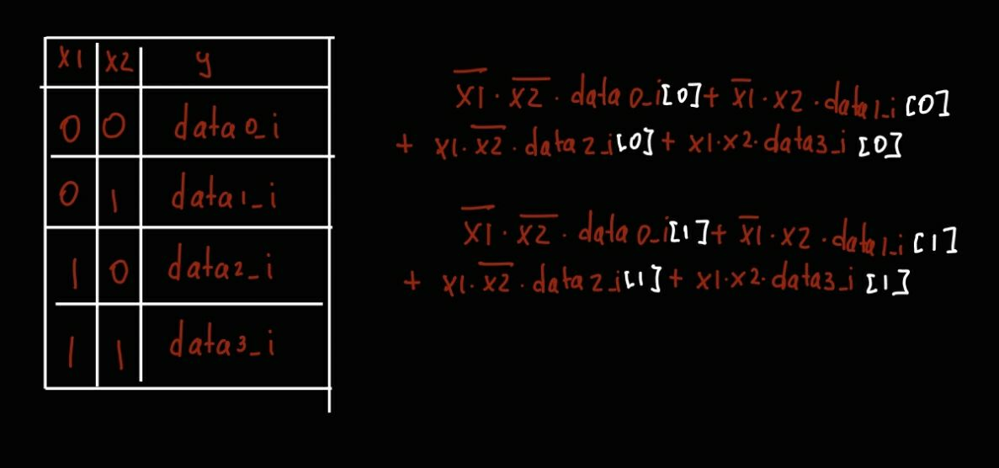

# 4:1 mux

## task
Требуется нарисовать модуль мультиплексора для 2-разрядных чисел с помощью Block diagram/Schematic редактора в Quartus.

Значение сигнала direction_i в каждый момент времени определяет, данные с какого входа транслируются на
выход.

## desc

| Имя сигнала | Напр-е | Разрядность | Комментарий                              |
| ----------- | ------ | ----------- |:---------------------------------------- |
| data0_i     | input  | 2           | Входные данные. Вход №0.                 |
| data0_i     | input  | 2           | Входные данные. Вход №1.                 |
| data0_i     | input  | 2           | Входные данные. Вход №2.                 |
| data0_i     | input  | 2           | Входные данные. Вход №3.                 |
| direction_i | input  | 2           | Номер входа, для использования на выходе |
| data_o      | output | 2           | Выходные данные.                         |

### alg
Функцию можно представить в виде



### test
В скрипте для ModelSim вызываются 2 собственные функции do_compile start_sim. bdf файл схемы из quartus уже скомпилирован в verilog файл.

В начале testbench происходит первичная инициализация, до момента когда rst_done станет равен 1.

Отправка проводится за счет генерации входной последовтельности в таске gen_data и передачи в 4 data_i переменных и direction_i в таске send_data. Между вызовами send_data нет задержек (опция burst, по умолчанию. Потому что нет валидности).

После отправки и перед ней целого числа, происходит запись в mailbox sended_data и глобальную переменную test_data, соответственно, для сохранения, и последующего тестирования. Данные из модуля в параллельном потоке читаются в mailbox read_data. Действие происходит в таске check_data, где проверяются выходные данные data_o, в будущем верификация происходит по сравнению генерированных и полученных данных.

Сравнение происходит в compare_date, когда пройдет TEST_CNT итераций.

При первого случаи несоответствия переданных и полученных данных, программа остановится. (можно изменять есть включить DEBUG)

### data
| WIDTH | Slow 1100mV 85C | Slow 1100mV 0C | ALMs/Registers |
| ----- | --------------- | -------------- | -------------- |
| 4     | 511.25          | 504.8          | 9, 12          |

## install

```
git clone https://github.com/t1msi/fpga_lab_1.git
cd fpga_lab_1/additional_lab/a_1_mux/tb/
vsim&

do make.tcl
```