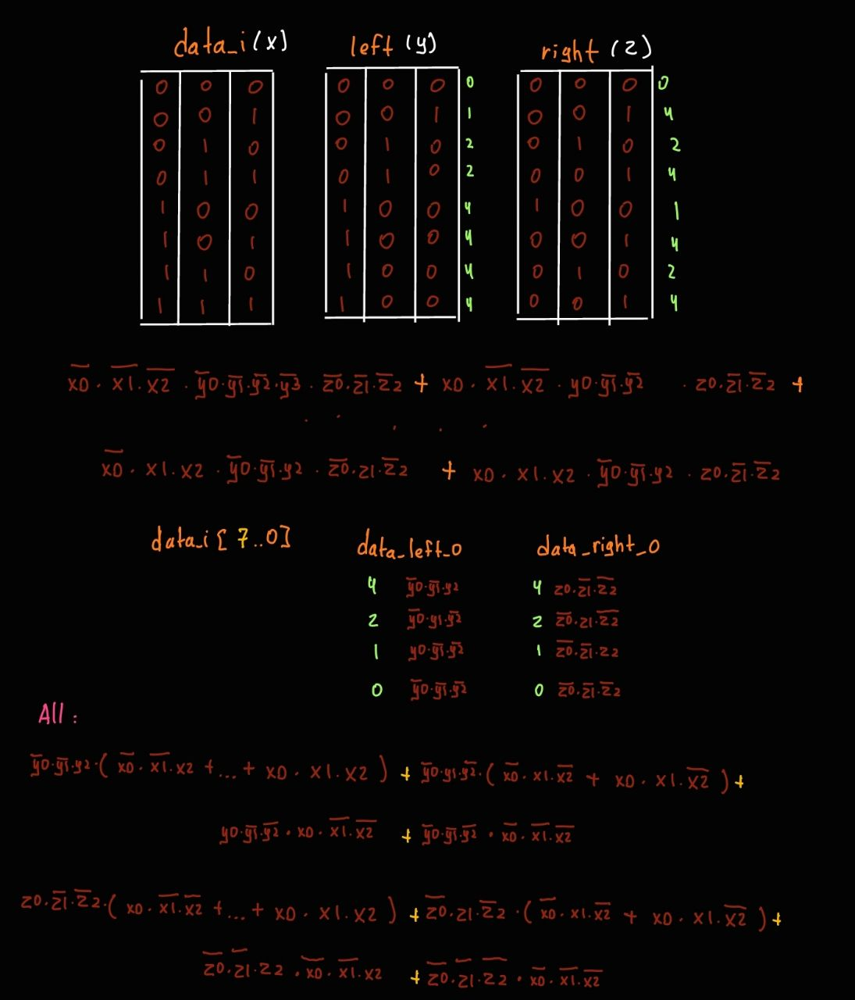

# priority_encoder (3 bit)

## task
Модуль должен во входном 3-битном числе найти самую правую и самую левую единицу и оставить только ее.

Требуется нарисовать с помощью Block diagram/Schematic редактора в Quartus.

## desc

| Имя сигнала  | Напр-е | Разрядность | Комментарий                                         |
| ------------ | ------ | ----------- |:--------------------------------------------------- |
| data_i       | input  | 3           | Входные данные.                                     |
| data_val_i   | input  | 1           | Сигнал валидности входных данных.                   |
| data_left_o  | output | 3           | Выходная крайняя левая единица.                     |
| data_right_o | output | 3           | Выходная крайняя правая единица.                    | 
| data_val_o   | output | 1           | Подтверждает валидность data_right_o и data_left_o. |

### alg
Функцию можно представить в виде



### test
В скрипте для ModelSim вызываются 2 собственные функции do_compile start_sim. bdf файл схемы из quartus уже скомпилирован в verilog файл.

В начале testbench происходит первичная инициализация, до момента когда rst_done станет равен 1.

Отправка проводится за счет генерации входной последовтельности в таске gen_data и передачи в data_i и data_val_i в таске send_data. Между вызовами send_data могут быть задержки (опция burst, по умолчанию).

После отправки и перед ней целого числа, происходит запись в mailbox sended_data и глобальную переменную test_data, соответственно, для сохранения, и последующего тестирования. Данные из модуля в параллельном потоке читаются в mailbox read_data. Действие происходит в таске check_data, где проверяются выходные данные data_o, в будущем верификация происходит по сравнению генерированных и полученных данных.

Сравнение происходит в compare_date, когда пройдет TEST_CNT итераций.

При первом случае несоответствия переданных и полученных данных, программа остановится. (можно изменять есть включить DEBUG)

### data
#### hand-made
| WIDTH | Slow 1100mV 85C | Slow 1100mV 0C | ALMs/Registers |
| ----- | --------------- | -------------- | -------------- |
| 3     | 580.05          | 531.91         | 9, 11          |

#### COMB_BASIC (1_3)
| WIDTH | Slow 1100mV 85C | Slow 1100mV 0C | ALMs/Registers |
| ----- | --------------- | -------------- | -------------- |
| 3     | 597.73, 580.05  | 570.78, 523.56 | 9, 11          | 

#### COMB_KR (1_3)
| WIDTH | Slow 1100mV 85C | Slow 1100mV 0C | ALMs/Registers |
| ----- | --------------- | -------------- | -------------- |
| 3     | 597.73, 580.05  | 570.78, 523.56 | 9, 11          | 

#### COMB_LOG (1_3)
| WIDTH | Slow 1100mV 85C | Slow 1100mV 0C | ALMs/Registers |
| ----- | --------------- | -------------- | -------------- |
| 3     | 592.07, 580.05  | 563.06, 531.91 | 10, 11         |

## install

```
git clone https://github.com/t1msi/fpga_lab_1.git
cd fpga_lab_1/additional_lab/a_2_priority_encoder/tb/
vsim&

do make.tcl
```