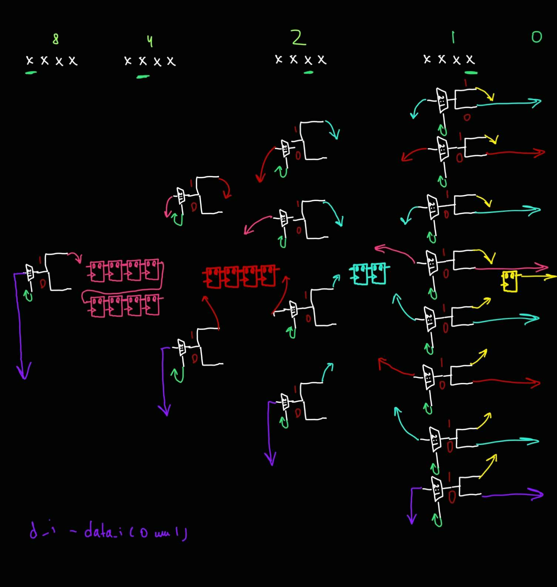

# delay_line (4 bit)

## task
Модуль должен задержать data_o на data_delay_i тактов.

Считаем, что значение data_delay_i будет меняться редко. Проверять работу модуля будут только через 16 тактов после того, как сменилось значение data_delay_i.

Требуется нарисовать с помощью Block diagram/Schematic редактора в Quartus.

## desc

| Имя сигнала  | Напр-е | Разрядность | Комментарий                                                                                           |
| ------------ | ------ | ----------- | :---------------------------------------------------------------------------------------------------- |
| data_i       | input  | 1           | Входные данные.                                                                                       |
| data_delay_i | input  | 4           | Сигнал валидности входных данных. Если 0, то передача не происходит, иначе количество тактов задержки |
| data_o       | output | 1           | Сигнал data_i задержанный на data_dealy_i тактов.                                                     |


### alg
Функцию можно представить в древовидном двоичном виде



- Розовым помечены AND2, которые составляют LUT, для упрощения рядом с ними используются OR2 и OR3, для передачи на разряд выше. Есть рассматриваемых сценария: 0000 - все нули (будет работать как провод), xx0x и xx1x (w/1) - уже присваивали data_i и передавали через сдвиговый регистр (отдельно рассматриваются случаи откуда приходит значение, то есть последний 0 или 1), 001x (new 1) - когда в первый раз будем передавать через регистры
- Оранжевым помечены AND2, которые берут значения AND2 для LUT и data_i (либо новое, либо из сдвигового регистра предыдущего разряда, либо, если несколько разрядов не передается, то из предыдущего значения для xx0x, помеченного OR зеленым). Для совмещения используется OR и помечается зеленым, после этого происходит передача в сдвиговый регистр или выше на разряд (для 0).
- Для удобства сделаны bus линии, все интерфейсные компоненты и регистры находятся сверху на схеме, а логика снизу.

#### scheme description

Давай посмотрим на [1] разряд (сверху второй блок из AND2 розовых, 6 штук), там проще всего увидеть логику. Рассматриваем 3 случая:
- 0 0 0 x: Это случай отдельно, когда во всех разрядах нули (цель - это довести до [0] разряда наверх, чтобы без записи в регистры передать data_i, т.е delay = 0)
- x x 0 x (with 1): (разложим на все возможные случаи:
  1) x 0 0 x - 1 0 0 x
  2) x 1 0 x - 1 1 0 x ) (цель - это определить все возможные комбинации, когда data_i уже прошел через регистры, на [2] или [3] разряде, т.е уже соединяли с data_i. OR2 передается на [0] разряд )
- x x 1 x (with 1 + new 1):
  1) x 0 1 x: 1 0 1 x   +   x 1 1 x: 0 1 1 x, 1 1 1 x (разница в [2] разряде, в последущем нужно знать откуда брать результат работы предыдущих разрядов)
  2) 0 0 1 x (new 1): до этого были только 0 и мы в первый раз будем передавать в регистры data_i. OR3 передается на [0] разряд, включая необходимые комбинации

Давай посмотрим на оранжевые AND2, также на [1] разряде. Смысл их в том, чтобы реализовать каждый отдельный случай. То есть соединяем результат работы:
1) предыдущего разряда (для x 1 0 x, x 1 1 x)
2) берем из x 0 x x (w/1), не пропущенный через регистры в предыдущем разряде, но уже с 1 (для x 0 1 x, x 0 0 x )
3) добавляем новый data_i (для 0 0 1 x (new 1))

Чтобы выбрать нужный case используем розовые AND2 для каждого отдельного случая

Соединяем эти результаты в:
x x 0 x OR2 гейт, для такой же передачи наверх
x x 1 x OR3 гейт, для передачи в регистры

[0] разряд сделан по аналогии, а в предыдущих слишком мало вариантов и нет абстракций в виде OR для передачи наверх. Большие bus сделаны для удобства

Тут главное в 00, 01, 10 и 11. А x это просто, чтобы сократить связи (как будто ветви в дереве объединяются)

### test
В скрипте для ModelSim вызываются 2 собственные функции do_compile start_sim. bdf файл схемы из quartus уже скомпилирован в verilog файл.

В начале testbench происходит первичная инициализация, до момента когда rst_done станет равен 1.

Отправка проводится за счет генерации входной последовтельности в таске gen_data и передачи в data_i (строб на несколько тактов) и data_delay_i в таске send_data. Между вызовами send_data не может быть задержки (опция burst, по умолчанию). Минимум DATA_WIDTH может быть >= 4 (из за итератора iter_inner в fifo_rd).

После отправки целого числа и перед ней, происходит запись в mailbox sended_data и глобальную переменную test_data, соответственно, для сохранения, и последующего тестирования. Данные из модуля в параллельном потоке читаются в mailbox read_data. Действие происходит в таске fifo_rd, где проверяются выходные данные data_o, в будущем верификация происходит по сравнению генерированных и полученных данных.

Сравнение происходит в compare_date, когда пройдет TEST_CNT итераций.

При первом случае несоответствия переданных и полученных данных, программа остановится. (можно изменять есть включить DEBUG)

### data
#### hand-made
| WIDTH | Slow 1100mV 85C | Slow 1100mV 0C | ALMs/Registers |
| ----- | --------------- | -------------- | -------------- |
| 4     | 380.81          | 359.07         | 8, 22          | 


## install

```
git clone https://github.com/t1msi/fpga_lab_1.git
cd fpga_lab_1/additional_lab/a_3_delay_line/tb/
vsim&

do make.tcl
```